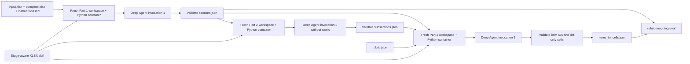

# Design Notes

Last updated: 2026-08-17

## Purpose

This document is the living design record for the Rubric Mapping Agent. It records decisions, alternatives, experiments, limitations, and implementation status. A decision marked **locked** is part of the intended design; a capability marked **implemented** exists and has been verified in the repository.

The first implementation milestone remains the Part 1 vertical slice, but the workbook skill and intermediate contracts now cover all three stages so early choices remain compatible with the Part 3 objective.

## Canonical assignment source

`Rubric Mapping Work Trial.docx` is the original and authoritative assignment document for this project. Design decisions, implementation requirements, and deliverable checks should be reconciled against it when ambiguity arises.

- Repository path: `docs/assignment/Rubric Mapping Work Trial.docx`
- Recorded size: `996012` bytes
- Recorded modification time: `2026-08-11 19:49:40 IST`
- SHA-256: `6553dc455a62a59fe749b845392b173b870af9eeb86b32b67b34db5f0bc5b201`

Treat a checksum change as a signal to re-read the assignment and review affected requirements before continuing.

## Status at a glance

| Area | Decision | Status |
| --- | --- | --- |
| Python environment | Use UV for dependency management, locking, environments, and commands | Locked and implemented |
| Agent framework | Use one Deep Agent per stage, orchestrated by a thin Python workflow | Locked; skeleton implemented |
| Model provider | Use OpenAI models as required by the assignment | Locked; exact model pending evaluation |
| Spreadsheet access | Use code execution with OpenPyXL and raw OOXML; use Pandas only for coordinate-backed bulk summaries | Locked; dependencies installed, inspection tooling not implemented |
| Spreadsheet skill | Use the project-local `xlsx-rubric-mapping` skill across Parts 1–3 | Locked, created, and validated |
| Computer use | Do not use a computer-use agent | Locked out |
| Visual rendering | Do not give worksheet screenshots to the runtime agent initially | Locked out of initial version |
| Agent topology | Begin with one primary agent rather than multiple collaborating agents | Locked for initial version |
| Code execution | Fresh OpenAI Code Interpreter container per stage, with network disabled | Locked and implemented; live invocation untested |
| LangGraph server | Expose the same stage dispatcher through `langgraph dev` | Configured and health-endpoint smoke-tested |
| Part 1 runtime | `create_overall_section` entry point, isolated agent call, strict output validation | Skeleton implemented; extraction quality untested |
| Part 2 representation | `create_intermediate_sections`, five-field rubric-free subsection handoff | Skeleton implemented; semantic quality untested |
| Part 3 runtime | Deterministic diff validation, optional upstream retrieval context, strict I2C validation | Skeleton implemented; mapping quality untested |

## Current repository state

### Completed

- Replaced the root `requirements.txt` workflow with a UV project.
- Added and locked the initial application dependencies.
- Synchronized a local UV-managed virtual environment.
- Preserved the supplied `rubric-mapping-eval` project as separate evaluation infrastructure.
- Created `skills/xlsx-rubric-mapping/SKILL.md` with shared inspection guidance and separate Part 1, Part 2, Part 3, output-contract, and evaluation references.
- Included the Apache-2.0 license and modification notice required for material adapted from OpenAI's historical spreadsheet skill.
- Confirmed that Deep Agents, LangChain's OpenAI integration, OpenAI's SDK, OpenPyXL, and Pandas import successfully in the UV environment.
- Validated the new skill's metadata and directory structure with the skill validator.
- Added a one-command example-evaluation runner that calls the supplied evaluator's Python APIs for both Part 1 and Part 3.
- Added the assignment-required `create_overall_section` and `create_items_to_cells_mapping` functions.
- Added the project-owned rubric-free `create_intermediate_sections` function and a three-stage `run_complete_workflow` orchestrator.
- Added the `rubric-map` CLI with `part1`, `part2`, `part3`, and `all` commands.
- Added a typed one-node LangGraph server entry point and `langgraph.json` configuration.
- Made every stage use a fresh temporary workspace and a fresh hosted Code Interpreter container containing only its explicitly allowed inputs.
- Removed local-shell execution; Deep Agents now uses a read-only filesystem backend for skill loading and OpenAI's provider-native Code Interpreter tool for Python.

### Not yet implemented

- Workbook structural extraction.
- Candidate-section generation.
- Production retry, timeout, observability, and data-retention hardening.
- Live OpenAI stage invocation and prediction generation.
- Part 1 predictions or evaluation runs.
- Part 2 and Part 3 prediction-quality evaluation.

## Proposed system architecture



The rubric is deliberately absent from Parts 1 and 2. It enters only at the Part 3 item-mapping boundary.

### Execution surfaces

The Python API is the source of truth. The CLI and LangGraph server are thin adapters over the same four functions:

```text
create_overall_section(input, complete, instructions) -> sections.json
create_intermediate_sections(input, complete, instructions, sections) -> subsections.json
create_items_to_cells_mapping(input, complete, instructions, rubric, *, sections?, subsections?) -> items_to_cells.json
run_complete_workflow(input, complete, instructions, rubric, output_dir) -> all three artifacts
```

Standalone Part 3 permits missing upstream artifacts because the assignment does not require Part 3 to depend on Part 1 or Part 2. The complete workflow always passes both so their downstream value can be measured.

Every `all` stage uses a new agent conversation, temporary read-only filesystem, and hosted Python container. This is slightly more expensive than one conversation, but it prevents rubric leakage, avoids carrying irrelevant stage instructions, makes retries local, and gives each artifact a deterministic validation boundary.

Deep Agents loads only the skill metadata initially. The stage prompt selects `xlsx-rubric-mapping`; `SKILL.md` then loads the shared inspection reference and exactly one stage reference plus the output contract. Running `all` never loads all three stage playbooks into one model context.

The orchestrator creates an explicit OpenAI Code Interpreter container for each stage, disables its network access, uploads only the stage's approved files, binds that container to the Deep Agent, and deletes it in `finally`. The model uses the provider-native `python` tool; no local execution tool is exposed. Deep Agents' filesystem backend remains read-only and contains only the staged inputs plus the skill references. The orchestrator—not the model—validates and atomically writes final JSON.

The default container tier is 4 GB because workbook inspection may hold formula and cached-value views simultaneously. `OPENAI_CODE_INTERPRETER_MEMORY` can select 1, 4, 16, or 64 GB; this is an explicit cost/capacity knob and should be evaluated against workbook size before production use.

## Part 1: Overall section creation

### Intended interface

```text
create_overall_section(input.xlsx, complete.xlsx, instructions.md) -> sections.json
```

The implementation will treat cell coordinates and workbook metadata as the source of truth. The language model will make semantic grouping decisions, while deterministic code will inspect workbooks, expand regions into cells, and enforce the output contract.

### Signals to inspect

- Cell values, formulas, data types, and cached results when available.
- Merged ranges and blank-but-formatted cells.
- Fonts, fills, borders, alignment, number formats, and style identifiers.
- Row heights, column widths, hidden state, and outline levels.
- Tables, named ranges, filters, freeze panes, and print areas.
- Formula and formatting patterns across adjacent rows and columns.
- Differences and unchanged structural relationships between the input and completed workbooks.
- Relevant workbook XML when the high-level library omits required metadata.
- Task instructions as business context rather than as a direct source of cell coordinates.

### Why Deep Agents

Deep Agents provides an existing agent loop, filesystem-oriented skills, tool integration, and LangGraph execution semantics. This should reduce orchestration work during the two-day trial and leave more time for spreadsheet representations, experiments, and error analysis.

The tradeoff is additional framework abstraction. If Deep Agents makes execution state or structured-output enforcement difficult, the fallback is a smaller LangGraph workflow using the same tools and intermediate schemas. The spreadsheet analysis and evaluator-facing interfaces should remain independent of this orchestration choice.

### Why structural inspection instead of visual inspection

The evaluator scores exact cell grouping. Workbook structure gives exact coordinates and exposes most relevant layout signals directly. Screenshots would introduce an additional rendering interpretation, potentially differing from Excel because of font substitution, wrapping, conditional-formatting behavior, or LibreOffice compatibility.

Visual inspection may be useful for human debugging, but it is not part of the initial agent runtime. It should only be reconsidered after an experiment demonstrates a measurable improvement over structural inspection.

### Why a project-local XLSX rubric-mapping skill

The project-local skill gives the agent one shared, read-only workbook procedure and stage-specific instructions for overall sections, intermediate subsections, and item-to-cell mappings. Progressive references keep irrelevant Part 3 rubric context out of Parts 1 and 2 while preserving a coherent representation across the whole assignment.

Selected OpenPyXL and Pandas guidance is adapted from OpenAI's historical `spreadsheet` skill at commit `e6afb0d74cc75d220df2faf3dd6c635c2dc6a108`, which is licensed under Apache-2.0. The project includes the license, source attribution, and a prominent modification notice. The skill is substantially changed for read-only financial-model analysis, evaluator isolation, exact JSON contracts, and Parts 1–3.

Anthropic's current XLSX skill is proprietary and explicitly restricts copying and derivative works. No Anthropic text, code, or assets are included or lightly paraphrased. General interoperability risks identified during review—formula caches, merged cells, external links, and recalculation hazards—are independently described and constrained for this project's read-only workflow.

Pandas is deliberately secondary. It can compact coordinate-tagged data and calculate bulk statistics, but OpenPyXL and raw OOXML remain authoritative because a DataFrame does not preserve the full workbook layout, formula, style, merge, and metadata model.

General workbook-creation instructions were intentionally not imported: formula authoring, chart creation, aesthetic restyling, and LibreOffice recalculation do not help this read-only mapping task and could mutate or reinterpret the source workbooks. Likewise, the current bundled OpenAI artifact-authoring workflow was used only as a cross-check; its editing and rendering requirements do not apply to this coordinate-extraction runtime.

### Why one primary agent initially

Part 1 has one tightly connected reasoning task: interpret a structural representation and choose section boundaries. Multiple agents would add handoff schemas, duplicated context, latency, and more difficult failure attribution before there is evidence that specialization helps.

Potential specialist agents should be added only when traces show a stable separable responsibility, such as independent financial-semantic review or targeted ambiguity resolution.

### Metric-driven implications

The Part 1 evaluator converts each section into every unordered pair of its cells, including self-pairs. Therefore:

- Over-merging independent regions creates many false-positive pairs and reduces precision.
- Over-splitting one coherent region removes cross-region pairs and reduces recall.
- Omitting or adding a single cell also affects its self-pair and all relationships with the rest of its section.
- Exact cell membership matters more than section names.

This favors conservative boundary decisions backed by multiple structural signals and deterministic cell expansion after the semantic decision is stable.

### Planned experiments

1. **Minimal structural baseline:** values, formulas, merges, and occupied ranges only.
2. **Formatting augmentation:** add borders, fills, fonts, number formats, and blank-but-formatted cells.
3. **Candidate constraints:** compare unconstrained cell grouping with agent selection among deterministic candidate regions.
4. **Input ablation:** compare input-only, complete-only, and input-plus-complete representations.
5. **Instruction ablation:** measure whether task instructions improve boundaries or introduce irrelevant business detail.
6. **Agent/model comparison:** compare eligible OpenAI models on quality, latency, token use, and estimated cost.
7. **Visual ablation only if needed:** compare the best structural system with an optional rendered-sheet signal before considering visual inspection.

Primary measurements will be grouping precision, recall, and F1 from the supplied evaluator. Development diagnostics should additionally record invalid-output rate, number of sections, section-size distribution, latency, token usage, and cost per workbook.

### Expected failure modes

- Visually similar neighboring schedules may be incorrectly merged.
- A title or footnote may be detached from the table it describes.
- Sparse rows or internal whitespace may cause an unnecessary split.
- Blank template cells may be omitted despite belonging to a section.
- A workbook may rely on drawings, text boxes, or Excel-specific behavior not surfaced by OpenPyXL.
- Large workbook maps may overwhelm the model unless repeated structure is compressed.
- The model may overfit terminology or layouts found in the three labeled examples.

## Part 2: Intermediate sections

Status: **Runtime skeleton implemented; semantic quality untested.**

Part 2 creates rubric-independent subsections inside or across Part 1 regions. Each subsection keeps exactly five stable fields: `subsection_id`, `parent_section_id`, `sheet`, `cells`, and `roles`. Semantic tags express historical versus projected periods, inputs and assumptions versus calculated outputs, controls, scenarios, totals, and other task-derived roles.

The default is a primary cell partition plus multiple semantic tags rather than many overlapping subsections. This keeps retrieval and debugging tractable while still representing cells along several semantic axes. Subsections may be non-rectangular or non-contiguous when the shape is financially explainable; they must not become arbitrary shapes tuned to the examples.

Part 2 has no assignment-mandated function or evaluator artifact. `create_intermediate_sections` and `subsections.json` are project-owned contracts introduced to make the stage independently runnable and the handoff testable. Labels, periods, formula signatures, evidence, and confidence stay in traces or the workbook map instead of bloating the handoff. Its value will be tested through Part 3 ablations, diff-cell coverage, fragmentation, contradictory-tag diagnostics, latency, and cost.

## Part 3: Items-to-cells mapping

Status: **Runtime skeleton implemented; retrieval and mapping quality untested.**

Part 3 must expose the required interface:

```text
create_items_to_cells_mapping(
    input.xlsx,
    complete.xlsx,
    instructions.md,
    rubric.json,
) -> items_to_cells.json
```

The system will deterministically compute the eligible workbook diff before the model sees mapping candidates. It will retain both workbook states, raw formulas, formula signatures, local headers, styles, periods, roles, dependencies, and Part 1/Part 2 membership for each diff cell. Candidate retrieval will move from rubric item to likely overall sections, semantic subsections, and finally eligible cells.

The model will decide which cells a judge should inspect, not every precedent or every cell in a related section. Every rubric item must appear exactly once, an empty predicted list is allowed, one cell may map to multiple items, and every selected cell must be a diff cell. Confidence and competing interpretations remain internal so the evaluator artifact retains its exact schema.

Because the primary score is criterion-macro I2C F1, candidate thresholds must balance precision and recall. This will be calibrated on labeled examples with direct-retrieval versus hierarchical-retrieval ablations rather than fixed by intuition.

## Reproducibility

The application environment is managed from the repository root:

```bash
uv sync --locked
```

All future Python commands, tests, scripts, and entry points should run through `uv run`. The supplied evaluator remains independently reproducible through its own UV project.

Run one stage or the complete pipeline through the installed CLI:

```bash
uv run rubric-map --help
uv run rubric-map part1 --help
uv run rubric-map all --help
```

Run the local LangGraph API server through:

```bash
uv run langgraph dev --no-browser
```

Evaluate all labeled examples after placing predictions under `artifacts/predictions/<task>/`:

```bash
uv run python scripts/evaluate_examples.py
```

## Open decisions

- Exact OpenAI model or model-routing policy.
- Container sizing, timeouts, retry limits, and organizational data-retention policy.
- Workbook-map and candidate-region schemas.
- Whether the agent receives full candidate cells or progressively requests local detail.
- Structured-output and retry policy.
- Confidence representation and failure behavior.
- Whether the Part 2 internal representation is persisted or generated on demand.
- How Part 1 and Part 2 evidence will constrain Part 3 mappings.

## With more time

- Build a broader private evaluation set with layout and financial-model diversity.
- Add trace-based error categorization and per-feature ablations.
- Test alternative candidate-generation and hierarchical sectioning strategies.
- Add adversarial workbooks containing hidden rows, unusual merges, sparse schedules, drawings, and large formatted ranges.
- Evaluate optional visual evidence only on cases where structural inspection demonstrably fails.
- Add model routing and caching after quality is established.

## Decision log

### 2026-08-17

- Selected UV as the only Python package and environment workflow.
- Selected LangChain Deep Agents on LangGraph for the initial agentic system.
- Selected structural workbook inspection through code execution.
- Replaced the development local-shell backend with one explicit OpenAI Code Interpreter container per stage; disabled container networking and added best-effort deletion after each invocation.
- Rejected computer use and runtime visual rendering for the initial version.
- Created and validated the initial Part-1-only `xlsx-sectioning` skill, then retired it after broadening the design.
- Replaced the Part-1-only skill with `xlsx-rubric-mapping`, covering Parts 1–3 through progressive references.
- Adapted permitted material from OpenAI's Apache-2.0 historical spreadsheet skill with license and modification notice; included no proprietary Anthropic material.
- Chose OpenPyXL/OOXML as coordinate truth and Pandas only for secondary bulk summaries.
- Added the minimal Deep Agents skeleton, assignment-required Part 1/Part 3 functions, project-owned Part 2 function, four CLI commands, and LangGraph server graph.
- Chose fresh stage invocations and artifact handoffs over one cross-stage conversation to preserve rubric isolation and progressive skill loading.
- Kept model selection configurable through `OPENAI_MODEL`; the current default is a starting point, not a locked evaluation result.
- Smoke-tested `langgraph dev`, graph import, and the local `/ok` health endpoint without invoking a model.
